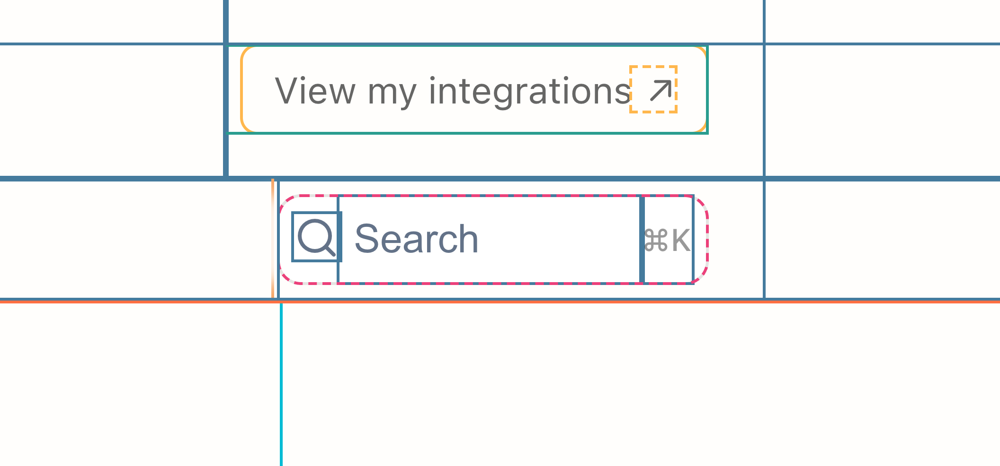

# CSS Debugger Chrome Extension

A lightweight Chrome extension that helps developers visualize and debug CSS layouts by adding colorful outlines to HTML elements. This tool makes it easy to identify and inspect element boundaries, margins, and nested structures with a simple click.

[Available in the Chrome Web Store](https://chrome.google.com/webstore/detail/css-debugger/ggkkdgkdccnmkjkiejcjmhgjapepnpen)

## Screenshots

See the extension in action:


*Example of CSS Debugger highlighting different HTML elements*


*Visualization of ::before and ::after pseudo-elements*

## Features

- 🎨 Colorful outline visualization for different HTML elements
- 🔍 Instant toggle with extension icon click
- 🎯 Support for common HTML elements including divs, sections, forms, and more
- 👻 Highlights pseudo-elements (::before and ::after)
- 🚀 Zero configuration required

## Color Coding

The extension uses the following color scheme for different HTML elements:

- General elements: `#E63946`
- Body children: `#2A9D8F`
- Div elements: `#457B9D`
- Article elements: `#9B5DE5`
- Section elements: `#00BCD4`
- Navigation: `#F4A261`
- Header: `#FF7043`
- Footer: `#4CAF50`
- Main content: `#7B1FA2`
- Aside elements: `#FF4081`
- Forms: `#009688`
- Lists (ul/ol): `#5C6BC0`
- List items: `#FF8A65`
- Paragraphs: `#66BB6A`
- Links: `#FFB74D`
- Images: `#4DD0E1`
- Form elements: `#EC407A`

## Installation

1. Download the latest `extension.zip` from the releases
2. Unzip the file
3. Open Chrome and navigate to `chrome://extensions/`
4. Enable "Developer mode" in the top right corner
5. Click "Load unpacked" and select the unzipped folder

## Usage

1. Click the CSS Debugger icon in your Chrome toolbar to toggle the debug view
2. The extension will add colored outlines to all elements on the page
3. Click the icon again to disable the debug view

## Development

To build the extension from source:

1. Clone this repository
2. Install dependencies:
   ```bash
   npm install
   ```
3. Build the extension:
   ```bash
   npm run build
   ```

This will create:
- A minified `css-debug.js` file
- An `extension.zip` file ready for distribution

## Permissions

The extension requires the following permissions:
- `activeTab`: To modify the current tab's styling
- `scripting`: To inject the debug scripts
- `storage`: To persist debug state per tab

## License

This project is released under the MIT License.